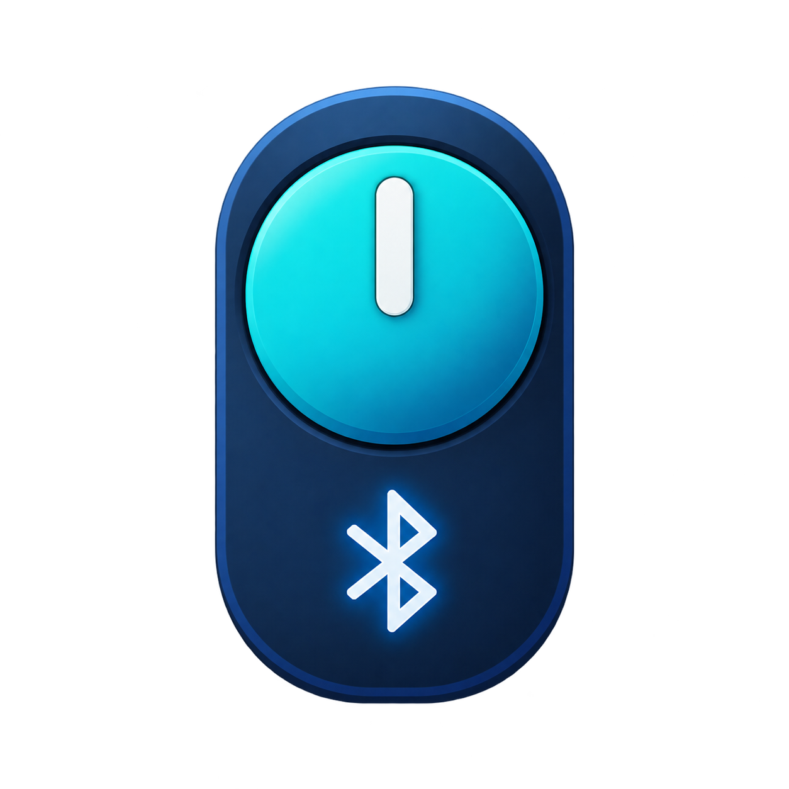

# Tuya Smartlock Local BLE

[Русский](README.ru.md) · [Installation](INSTALL.md) · [Architecture](ARCHITECTURE.md)

Local Bluetooth control for **A1 Ultra / A1 Ultra-JM**, Tuya product **hc7n0urm**, category **jtmspro**, FD50 service. Other products are not currently supported merely because they share a similar name.

- Lock and unlock from Home Assistant without a phone BLE connection.
- Persistent connection enabled by default, status-only heartbeat and bounded reconnect delays.
- Battery category, optional signal strength, sound volume, rotation direction and an explicit recalibration button.
- Setup through the HA interface; no YAML or prefilled credential file required.
- Composable protocol sessions, payload dialects and commands for contributors adding models.

**You must obtain your own device credentials first.** Bluetooth discovery does not retrieve keys. An existing Tuya integration does not automatically supply them. See [INSTALL.md](INSTALL.md#obtain-your-own-credentials).

## Requirements and installation

Home Assistant **2026.10.0 or newer**, a working connectable Bluetooth adapter/proxy in HA, a powered lock in range, HACS for the recommended installation. The tested hardware used local BlueZ Bluetooth; proxies have not been hardware-verified here.

Add `https://github.com/asemenov566/tuya_smartlock_local_ble` to HACS as a custom **Integration** repository. This is not an entry in the default HACS catalog. Follow the [complete installation guide](INSTALL.md) through the first connection.

## Status and limitations

Lock/unlock and persistent BLE operation were physically verified in the preceding implementation. The refactored 0.2.0 and clean HACS installation need user acceptance testing. Direction, volume and calibration use the product's identified DP mapping and have automated command tests; physical behavior is not yet verified. Calibration can move the motor and changes its travel settings; it is never run during setup or heartbeat.

Lock state is assumed from acknowledged commands, supplemented by BLE reports. It is not a certified door-position sensor. Battery reports are categories, not percentages. Camera/cloud-only functions are not implemented. Continuous connection may increase battery use; 24-hour stability and battery endurance have not been measured.

## Local operation

After provisioning, the component communicates over BLE and makes no Tuya cloud calls. SmartLife/Tuya is needed to provision the lock and obtain credentials. Factory reset or rebinding may change them. Do not delete the lock from SmartLife as a way to disable cloud access: rebinding behavior has not been verified.

The internal HA domain remains `tuya_local_ble_custom` for existing installations. Install only one package providing that domain. Public `tuya_ble` / `tuya_local_ble` use different domains, but only one integration should actively connect to a given physical lock.

## Development

See [ARCHITECTURE.md](ARCHITECTURE.md) and the repository [add-lock skill](.skills/add-lock/SKILL.md). Tests use synthetic values and fake devices. Never submit device keys, HA storage files or raw diagnostics in issues or pull requests.

Licensed under [MIT](LICENSE).

The MIT license allows use, modification and redistribution, including commercial use, with the copyright and permission notices preserved. The inherited notice and the 2026 contribution notice are both included in LICENSE.
