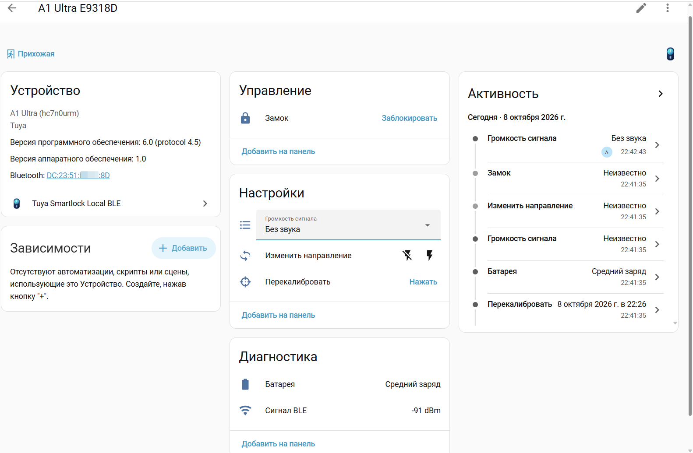

# Tuya Smartlock Local BLE

[English](README.md) · [Установка](INSTALL.ru.md) · [Архитектура](ARCHITECTURE.md)

Локальное управление **A1 Ultra / A1 Ultra-JM** через Bluetooth. Поддерживается Tuya product **hc7n0urm**, категория **jtmspro**, сервис FD50. Похожее название другого замка не означает совместимость.

- Закрытие и открытие из Home Assistant без BLE-подключения телефона.
- Постоянное соединение по умолчанию, запросы состояния и восстановление с задержкой после сбоев.
- Уровень батареи и дополнительный датчик Bluetooth-сигнала (RSSI).
- Настройка через интерфейс HA без ручной правки YAML/JSON.
- Отдельные классы моделей, протоколов и команд для расширения поддержки.

**Сначала нужно получить данные своего замка.** Обнаружение по Bluetooth не извлекает ключи. Наличие интеграции Tuya не означает их автоматический импорт. Порядок описан в [INSTALL.ru.md](INSTALL.ru.md).

## Управление и диагностика

| Возможность | Что делает |
| --- | --- |
| Закрытие / открытие | Управляет замком из интерфейса HA, скриптов и автоматизаций по локальному BLE. |
| Перекалибровка | По нажатию кнопки отправляет команду калибровки этой модели; она может двигать мотор и изменять настройки его хода. |
| Направление вращения | Переключает направление мотора под ориентацию установки. |
| Громкость сигнала | Выбор **Без звука** или **Нормальный**; другие уровни для этой модели не реализованы. |
| Батарея | Показывает переданную замком категорию: высокий, средний, низкий заряд или разряжена; без выдуманного процента. |
| Сигнал BLE | Дополнительный RSSI-датчик в dBm, по умолчанию отключён. В отключённых объектах устройства активируйте **Сигнал BLE**. Он показывает последний принятый BLE-анонс, а не непрерывное измерение активного соединения. |
| Сведения об устройстве | Версии прошивки, протокола BLE и аппаратного обеспечения. |
| Постоянное соединение | Периодически запрашивает состояние и повторяет подключение после сбоев; непрерывность радиосвязи не гарантируется. |

Настройки могут показывать **Неизвестно**, пока замок не передаст их или не подтвердит изменение. Калибровка никогда не запускается автоматически при добавлении, восстановлении связи и опросе состояния. Установка прошивки (OTA) пока не реализована.

## Страница устройства в Home Assistant

Страница устройства в Home Assistant на русском языке.

При разрыве соединения повторное подключение начинается после короткой паузы; неудачные попытки получают увеличивающуюся задержку. По умолчанию объекты становятся недоступными на время разрыва.

В **Настроить** можно включить **Ожидать переподключения перед командой (до 10 секунд)**. Настройка выключена по умолчанию и требует постоянного соединения. В первые 10 секунд разрыва объект замка продолжает принимать открытие/закрытие: одна принятая команда ждёт готовности защищённого сеанса максимум 10 секунд с момента нажатия и отправляется один раз. После истечения срока она отбрасывается. Повторное нажатие во время ожидания или выполнения возвращает ошибку, а не добавляет команду в очередь. При отключении настройки, выгрузке интеграции или перезапуске ожидание отменяется и не сохраняется.

Если отправка уже началась, потеря ответа не вызывает повтор моторной команды. Десятисекундный срок ограничивает ожидание **начала отправки**; подтверждение уже отправленной команды может ожидаться дольше. Калибровка, направление и громкость этим режимом не затрагиваются. Во время ожидания/разрыва состояние замка — «Неизвестно»; атрибуты `bluetooth_connected` и `command_pending` показывают связь и выполнение. Остальные объекты сохраняют обычную доступность по BLE.

В текущих аппаратных испытаниях сохранялись короткие разрывы примерно раз в две минуты с автоматическим восстановлением. Причина этого цикла ещё исследуется; режим постоянного соединения пока не обеспечивает полностью непрерывную доступность.

## Установка

Нужны Home Assistant **2026.10.0 или новее**, настроенный Bluetooth с поддержкой подключений, включённый замок в радиусе приёма и HACS. На оборудовании проверялся локальный адаптер BlueZ; работа через прокси отдельно не проверялась.

Добавьте `https://github.com/asemenov566/tuya_smartlock_local_ble` в HACS как пользовательский репозиторий типа **Интеграция**. В стандартный каталог HACS проект не включён. Следуйте [инструкции от установки до первого соединения](INSTALL.ru.md).

## Границы проверки

Открытие, закрытие, BLE-связь и датчик сигнала проверялись на реальном оборудовании в ходе разработки. Громкость, направление и калибровка реализованы по установленной схеме команд модели и покрыты автоматическими тестами; полная аппаратная проверка каждой настройки ещё предстоит.

Состояние замка определяется по подтверждённым командам и доступным BLE-сообщениям, а не отдельным датчиком положения двери. Батарея представлена категориями, без выдуманного процента. Камера и функции только для облака не реализованы. Постоянная связь может увеличить расход батареи; суточная стабильность и срок работы батареи не измерялись.

## Работа без облака

После первоначальной настройки компонент общается с замком по BLE и не обращается к Tuya Cloud. SmartLife/Tuya нужны для привязки и получения ключей. После сброса или перепривязки данные могут измениться. Удалять замок из SmartLife для отказа от облака не нужно: последствия такой отвязки для ключей не проверены.

Domain HA и каталог компонента — **`tuya_smartlock_local_ble`**, как имя репозитория. Другие интеграции Tuya можно установить рядом, но активно подключаться к конкретному замку должна только одна BLE-интеграция.

## Разработка

[Архитектура](ARCHITECTURE.md), [скилл добавления моделей](.skills/add-lock/SKILL.md). Тесты используют искусственные данные и имитацию устройств. Не прикладывайте ключи, файлы HA `.storage` и необработанную диагностику к issues/PR.

Лицензия [MIT](LICENSE).

MIT разрешает использовать, изменять и распространять код, в том числе коммерчески, при сохранении уведомлений об авторских правах и разрешении. В LICENSE сохранено исходное уведомление и добавлено авторство наших изменений за 2026 год.
